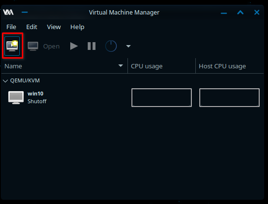

# Setting Up a Basic Windows VM Using QEMU and libvirt
Are you tired of running Windows on actual hardware? Look no further! 
This guide will walk you through the process of setting up a basic Windows VM using QEMU and libvirt on Manjaro.


## Prerequisites
Before we get started, we need to make sure we have the required tools and packages installed on our system.

In order to install Windows on our virtual machine, we will need an installation media (ISO file). You have the option of using either Windows 10 or Windows 11.

* To download Windows 10, visit: https://www.microsoft.com/software-download/windows10
* To download Windows 11, visit: https://www.microsoft.com/software-download/windows11

Make sure you have your chosen installation media ready before proceeding to the next steps.

### Install Required Packages
To install the necessary packages, run the following command in your terminal:
```bash
sudo pamac install qemu libvirt edk2-ovmf virt-manager
```

### Prepare libvirt
To ensure that the libvirtd daemon is running when required, enable and start it with the following commands:
```bash
sudo systemctl enable libvirtd
sudo systemctl start libvirtd
```

Next, add yourself to the libvirt group to ensure you have the necessary permissions:
```bash
sudo usermod -aG libvirt $(whoami)
```

### Enable the Default Network
To enable the default network for libvirt, run these commands:
```bash
sudo virsh net-autostart default
sudo virsh net-start default
```


## Creating a Basic Windows VM
Now that you have all the necessary prerequisites in place, it's time to fire up virt-manager and create your virtual machine.

### Launch virt-manager
Open virt-manager and you will be presented with the main interface. Click the "Create a new virtual machine" button, as shown in the image below, to start the setup process.



### Configure VM Settings
On the first page of the setup process, select "Local install media (ISO image or CDROM)" as the installation method, as shown in the image below.


Next, you will need to locate the ISO file for your Windows installation media. Click the "Browse..." button and select the ISO file from your computer. If you are using Windows 10, make sure to uncheck the "Automatically detect from the installation media / source" checkbox and manually specify which OS you are using.


The remaining pages of the setup process will allow you to customize your VM settings, such as the amount of RAM and storage you want to allocate. 

Once you reach the "Finish" page, check the "Customize configuration before install" box and click "Finish" to proceed to the final configuration step.


### Customize CPU Topology
A new window will open, allowing you to customize the VM further. 
In the left list, select "CPUs" and then expand the "Topology" category on the right side. Check the "Manually set CPU topology" box, as shown in the image below.


Next, set the number of sockets to 1 and adjust the number of cores and threads according to your CPU. 

For example, if you have an Intel i7 12700 with 20 cores and you want to pass through 16 of them to your virtual machine, you would set the number of threads to 2 (since each core has 2 threads) and the number of cores to 8 (since 8 x 2 = 16). 
See the image below for an example of how this would look.

<b>WARNING:</b> It is important to leave at least 2 cores for the host operating system to function properly.


Once you have configured your CPU topology, click "Apply" and then "Begin Installation" in the top left corner to start installing Windows on your virtual machine. 

Follow the prompts to complete the installation process, and you will have a fully functional Windows VM in no time!


## Final Notes
You are now ready to run this VM like you normally would a real Windows Desktop.

There are a few additional things to keep in mind as you continue using your virtual machine:

### Faster Storage
You can increase your storage speeds passing trough an entire disk through to your virtual machine. To do this, add a storage device and set the custom storage location to the device path. See the example image below for more details.

<details>
  <summary>Exapand to see the example image.</summary>
  
</details>

### Gaming VMs
If you are interested in setting up a gaming virtual machine, you may want to take a look at the following topics for further information:

* [GPU Passthrough](./gaming/gpu-passthrough.md) </br>
  Allowing your VM to access your GPU.

* [Looking Glass](./gaming/looking-glass.md) </br>
  VGA PCI Pass-through without an attached physical monitor, keyboard or mouse.

### VFIO Community
If you need help or want to connect with other virtual machine users you can join the VFIO Discord at https://discord.gg/f63cXwH.

Thanks for following this guide, and happy virtualization!
