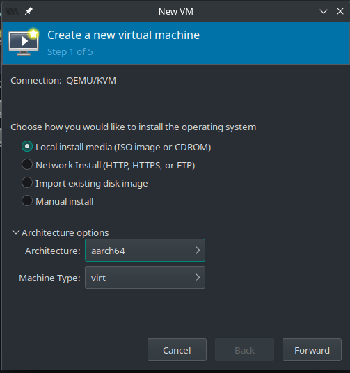

# Emulating a Different Architecture
Are you interested in emulating a different architecture in your virtual machine? Look no further!
This guide will walk you through the process of adding support for emulating a different architecture using QEMU and libvirt on Linux.

## Prerequisites
Before we get started, ensure that you have completed the prerequisites mentioned in the previous guide on [setting up a basic Windows VM using QEMU and libvirt](./basic-vm.md).

## Installing the target Architecture
To add support for emulating a different architecture, you'll need to install specific packages depending on the architecture you want to emulate.
Here are some common packages for popular architectures:

### AARCH64 Architecture
To emulate AARCH64 architecture, install the following packages:
```bash
sudo pamac install qemu-system-aarch64
```

### ARM Architecture
To emulate ARM architecture, install the following packages:
```bash
sudo pamac install qemu-system-arm
```

### RISC-V Architecture
To emulate RISC-V  architecture, install the following packages:
```bash
sudo pamac install qemu-system-riscv
```

### Other Architectures
For other architectures, search for the appropriate QEMU package for your desired architecture and install it.

## Configuring the Virtual Machine
Once you have installed the necessary packages, you can proceed to configure the virtual machine to emulate the desired architecture.
Follow the steps outlined in the previous guide, but with some modifications based on common sense.

### Selecting the Architecture
During the virtual machine creation process in virt-manager, you will reach a step where you need to select the architecture for your virtual machine.
Instead of choosing the default x86 architecture, select the architecture you want to emulate.
The available options will depend on the packages you installed.

See the example image below for reference:



### Adjusting CPU 
You may need to make sure to adjust the CPU topology settings according to the architecture you are emulating.
Refer to the documentation or specifications of the architecture to determine the correct values for the number of sockets, cores, and threads.

## Final Notes
Congratulations! You can now run virtual machines using the architecture you configured. 
However, please keep in mind that emulating different architectures may not provide the same level of performance as using the host architecture.

Happy virtualization!