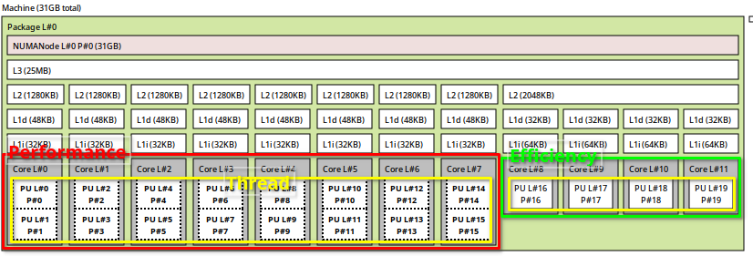

# Optimizing your Gaming VM

Virtual machines (VMs) can be a great way to play your favorite games on a different operating system, or even on a different computer. However, without proper optimization, performance in a VM can suffer. In this guide, I will show you how to configure your KVM/QEMU gaming VM for optimal performance.


## CPU pinning

CPU pinning, also known as CPU affinity, allows you to specify which host CPU cores your virtual machine's virtual CPUs (vCPUs) should run on. This can help ensure that your VM's vCPUs receive adequate resources and prevent them from interfering with other processes running on the host machine.

### Determining the CPU Topology

Before you can configure CPU pinning, you'll need to know the layout of your host machine's CPU cores. You can use the `lstopo` tool to view this information.

```ruby
$ lstopo
```
If this does not work, just install it using your favorite package manager.

This will display a graphical representation of your host machine's CPU topology, including the number of sockets, dies, cores, and threads.


### Configuring CPU Pinning

To configure CPU pinning, you'll need to modify your VM's XML configuration file. 

As an example, let's assume you have an Intel i7-12700K CPU, which has 20 cores (8 performance cores each with 2 threads and 4 efficiency cores), and you want to pass through 6 cores with 2 threads.



When passing through cores, it's recommended to do so in series, either from left to right or right to left. 

In this example, since you want to assign 12 threads to your 12 vCPU VM and because you would want to use your performance cores, you'll choose a left-to-right configuration.


It's crucial to keep the CPU core "siblings" together. 
So, if you want vCPU 0 to have 2 threads, you have to pin thread #0 and thread #1 from your core #0 to this vCPU.

With this information in mind, you can now update your VM's XML configuration as follows:

```xml
<domain type="kvm">
  ...
  <vcpu placement="static">12</vcpu> <!-- number of cores -->
  <cputune>
    <vcpupin vcpu="0" cpuset="0"/> <!-- vCPU 0 - thread #0 -->
    <vcpupin vcpu="1" cpuset="1"/> <!-- vCPU 0 - thread #1 -->
    <vcpupin vcpu="2" cpuset="2"/>
    <vcpupin vcpu="3" cpuset="3"/>
    <vcpupin vcpu="4" cpuset="4"/>
    <vcpupin vcpu="5" cpuset="5"/>
    <vcpupin vcpu="6" cpuset="6"/>
    <vcpupin vcpu="7" cpuset="7"/>
    <vcpupin vcpu="8" cpuset="8"/>
    <vcpupin vcpu="9" cpuset="9"/>
    <vcpupin vcpu="10" cpuset="10"/>
    <vcpupin vcpu="11" cpuset="11"/>
  </cputune>
  <cpu mode="host-passthrough" check="none" migratable="on">
    <topology sockets="1" dies="1" cores="6" threads="2"/> <!-- 6 cores and 2 threads -->
    <cache mode='passthrough'/>
  </cpu>
  ...
</domain>
```

Once you start your VM, it should run more smoothly and stable. 
However, don't stop here! There are a few more optimizations you can make to improve your setup.


## Hypervisor features

Virtualization software such as KVM (Kernel-based Virtual Machine) provide various features that can improve the performance and stability of your virtual machine. 
These features can be added as flags to the hypervisor during the creation of the virtual machine.

### Adding Hypervisor flags

To improve the performance and stability of your virtual machine, you can configure the following hypervisor flags. 

Simply copy the following configuration into your virtual machine's XML file:

```xml
<features>
  ...
  <hyperv>
    <relaxed state="on"/>
    <vapic state="on"/>
    <spinlocks state="on" retries="8191"/>

    <vpindex state="on"/>
    <synic state="on"/>
    <stimer state="on"/>
    <reset state="on"/>
    <frequencies state="on"/>

    <!-- this was needed to prevent an error with nvidia drivers, but should now be obsolete -->
    <vendor_id state="on" value="iamavendor"/>
  </hyperv>
  ...
</features>
```

### Hiding VM for AntiCheat

Some games may block players who are using virtual machines, so hiding the virtualization technology from the guest operating system may be necessary to avoid this issue.

```xml
<feature>
  ...
  <kvm>
    <hidden state="on"/>
  </kvm>
  ...
</feature>
```

It is important to note that while these techniques may help to hide the virtual machine from some AntiCheat systems, it is still possible that the AntiCheat will detect your VM anyway. 
Battle Eye for example, may prevent you from joining multiplayer games, but it will not ban you.

Please keep in mind that these methods have a 99.99% safety rate, however, there is no warranty provided and using these methods is done at your own risk.


## Final Thoughts

To enhance the performance of your gaming virtual machine, consider exploring the following topics:

  * GPU Passthrough: This technique can dramatically improve gaming performance compared to virtual graphics. I have written a guide on it, which you can find <a href="./gpu-passthrough.md">here</a>.

  * RAM and Storage Optimization: Adequate RAM and storage configurations can ensure fast loading times and smooth game performance. If you have a NVME SSD, it can be passed to the virtual machine just like a GPU.

  * Networking Configuration: Multiplayer games may benefit from a bridged connection setup for your virtual machine.

By incorporating these optimizations and others, you can create a top-notch gaming virtual machine that offers a seamless and enjoyable gaming experience.